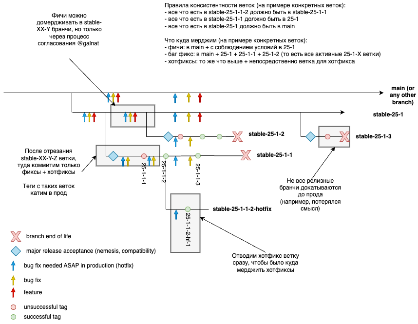

# Работа с релизными ветками

## Виды коммитов {#commit_types}

* **Фича**. К фичам относятся любые приносящие новую функциональность изменения, не являющиеся исправлением багов.
* **Исправление бага**. К исправлению багов НЕ относятся полностью переписанные с нуля подсистемы, которые, в теории, не будут после этого подвержены багам.
* **Исправление критического бага**. Исправление бага, которое необходимо ASAP получить в продакшн. Сюда не относятся обычные исправления, только те, ради мерджа которых собирался созвон. Без срочного исправления критических багов с опасной вероятностью наступают тяжелые последствия.

# Manage {{ ydb-short-name }} releases

На базе исходного кода из [репозитория {{ ydb-short-name }}](https://github.com/ydb-platform/ydb) разрабатываются два продукта с независимыми релизными циклами:

- [Сервер {{ ydb-short-name }}](#server)
- [Интерфейс командной строки {{ ydb-short-name }} (CLI)](#cli)

## Релизный цикл сервера {{ ydb-short-name }} {#server}

Данный документ описывает релизный цикл, начиная с мажорного релиза 25.1.

По любым возникающим вопросам по этому документу пишите [Максиму Юрчуку](https://staff.yandex-team.ru/maxim-yurchuk) или [Наталье Пироговой](https://staff.yandex-team.ru/galnat).

### Номера и расписание релизов {#server-versioning}

Версия сервера {{ ydb-short-name }} состоит из четырех чисел, разделенных точкой:

1. Две последние цифры календарного года релиза
2. Порядковый номер мажорного релиза в этом году
3. Порядковый номер минорного релиза в этом мажорном
4. Порядковый номер патча (он же релизный тег)

Таким образом, мажорная версия сервера {{ ydb-short-name }} - это комбинация первый двух чисел (например, `23.3`), минорная версия - это комбинация первых трёх (например, `23.3.1`), а полная версия - это комбинация всех четырёх (например, `23.3.5.1`).

Расписание релизов сервера {{ ydb-short-name }} обычно включает в себя 4 мажорных релиза ежегодно, поэтому релиз `YY.1` является первым, а `YY.4` - последним в году `YY`. Количество минорных релизов и патчей не является постоянным и может варьироваться от одного мажорного релиза к другому.

### Совместимость {#server-compatibility}

{{ ydb-short-name }} поддерживает совместимость между мажорными версиями таким образом, чтобы гарантировать, что кластер может работать, когда на его узлах выполняются две смежные мажорные версии исполняемого файла сервера {{ ydb-short-name }}. Вы можете обратиться к статье [Обновление {{ ydb-short-name }}](../devops/manual/upgrade.md) для информации о процедуре обновления кластера.

Учитывая вышеуказанную цель совместимости, мажорные релизы выпускаются парами, в основном с добавлением в нечетных версиях новой функциональности, отключенной feature-флагами, и включением этой функциональности по-умолчанию в четных.

Например, версия `23.1` поставляется с отключенной новой функциональностью, и может быть постепенно развернута на кластере, работающем под управлением `22.4`, без остановки работы кластера. Как только на всех узлах кластера будет запущена `23.1`, его можно будет далее обновить до `23.2`, чтобы использовать новые функциональные возможности.

### Релизные ветки и теги {#server-branches-tags}

## Типы релизных веток {#release_branch_types}

* **Мажорная ветка** - ветка, совместимая с предыдущей и последующей мажорными ветками. Такие ветки именуются `stable-XX-Y`, например, `stable-24-1` или `stable-25-1`. Нечетная мажорная ветка отводится от `main`, а четная от предыдущей нечетной (например, `stable-24-3` был отведен от `main`, а `stable-24-4` от `stable-24-3`). Новые фичи могут мерджиться в мажорную ветку согласно инструкции ниже. Исправления багов могут мерджиться в мажорную ветку, если они должны попасть в релиз.
* **Минорная ветка** - ветка, в которой создаются релизные теги, после чего выкатываются на кластера. Такие ветки именуются `stable-XX-Y-Z`, например, `stable-25-1-2`. Релизные теги именуются `XX-Y-Z-A`. Минорная ветка отводится только от мажорной ветки после успешной выкатки предыдущей минорной ветки. В минорную ветку можно мерджить только исправления багов. После отведения ветки запускаются приемочные тесты, и исправляются выявленные ошибки. Далее создается тег, который пробуем раскатить на прод. В случае проблем мерджаться исправления и создается новый релизный тег. После успешной выкладки тега остается возможность мерджить багфиксы в эту минорную ветку и выкатывать их на прод, если стабилизация новой минорной ветки затягивается.
* **Хотфиксная ветка** - ветка, которая предназначена для исправления критических багов в конкретном релизном теге. Именуется `stable-XX-Y-Z-A-hotfix` (`XX-Y-Z-A` - имя релизного тега), например, `stable-24-1-1-2-hotfix`. Такие ветки отводятся только от релизных тегов из минорных веток при необходимости сделать критический фикс. После отщепления такой ветки в нее могут мерджиться только исправления критических багов, которые необходимо ASAP получить в продакшн.

## Общая схема работы с ветками {#release_branch_scheme}

## Как замерджить исправления багов в релизную ветку

Исправления багов, которые нужно выкатить на продакшен, следует замерджить в `main` и активные мажорные ветки. Они выедут на продакшен со следующей минорной веткой.

Исправления багов, которые нужно выкатить быстрее (за 1-2 недели):

1. следует замерджить в `main`, активные мажорные ветки,
2. согласовать мердж в активные минорные ветки на онколе,
3. после согласования замерджить в активные минорные ветки.

Активные мажорные и минорные ветки можно узнать из запиненного сообщения в [чате YDB Releases](https://t.me/+OL2sTkGoW64zY2My).

## Как замерджить исправления критических багов в релизную ветку

Чтобы замерджить исправления критических багов нужно:

1. Посмотреть версию базы (совпадает с номером релизного тега), на которой есть проблема.
2. Найти хотфикс ветку по номеру релизного тега - `stable-XX-Y-Z-A-hotfix` (`XX-Y-Z-A`- имя релизного тега).
3. Замержить исправление в main, хотфикс ветку, активные мажорные и минорные ветки.

Если баг обнаружен не на конкретном релизном теге, то нужно замерджить исправление в main, активную хотфикс ветку, активные мажорные и минорные ветки.

Активные мажорные и минорные ветки можно узнать из запиненного сообщения в [чате YDB Releases](https://t.me/+OL2sTkGoW64zY2My).

## Как замерджить фичу в релизную ветку

Чтобы замерджить фичу в мажорную ветку (например, `stable-25-1`) после ее отведения, нужно:

1. Согласовать мердж фичи в релиз со своим руководителем.

2. Вписать фичу в [таблицу](https://wiki.yandex-team.ru/kikimr/developers/releases/) (выбери актуальный релиз) с релизным планом:

   * приложить тикет, в котором велась разработка,
   * приложить тикет на включение фичи на кластерах (если такого нет, завести по [шаблону](https://st.yandex-team.ru/createTicket?queue=YDBOPS&template=4547)),
   * пометить является ли фича обратно совместимой - катим включенной по дефолту или с выключенным флагом (если с флагом, указать с каким),
   * **must** приложить тест-план и согласовать его с [Максимом Юрчуком](https://staff.yandex-team.ru/maxim-yurchuk),
   * указать ответственного за фичу разработчика,
   * указать Feature Owner, если такового нет - тимлида команды,
   * приложить ссылку на документацию или PR в документацию,
   * приложить PR в CHANGELOG.md с релиз ноутами к фиче.

3. Создать Pull Request в мажорную ветку, указав в блок `Description for reviewers` описания Pull Request причину – зачем мержить фичу в текущий релиз. Тесты в Pull Request должны быть зеленые.

В минорные ветки, начиная с `stable-XX-Y-2`, будут замерджены не более трех фич, не включая переключения флагов. Это означает, что ваша фича может не попасть в ближайший релизный тег. Это ограничение вводится, чтобы на отладку релизных тегов уходило меньше времени.

Цикл выпуска для нечетного мажорного релиза начинается с отведения ветки от `main` ветки участником [релизной команды {{ ydb-short-name }}](https://github.com/orgs/ydb-platform/teams/release). Название релизной ветки начинается с префикса `stable-`, за которым следует мажорная версия с точками, замененными на дефис (например, `stable-23-1`).

Цикл выпуска четного мажорного релиза начинается с отведения ветки от ветки предыдущего нечетного мажорного релиза.

Все выпуски мажорных версий, как четных, так и нечетных, проходят цикл тестирования, в процессе которого создается ряд минорных версий. Каждая минорная версия фиксируется путем назначения тега с полным номером версии на соответствующей релизной ветке. Таким образом, в ветке `stable-24-1` могут быть теги `24.1.1`, `24.1.2` и т.д. Как только минорная версия успешно прошла необходимое тестирование, мы считаем ее стабильной, и регистрируем релиз на GitHub для ее тега, добавляем его на страницы документации [загрузки](../downloads/index.md#ydb-server) and [список изменений](../changelog-server.md), и так далее. Для мажорной версии может быть более одного стабильного релиза.

### Тестирование {#server-testing}

Тестирование релиза является итеративным. Каждая итерация начинается с назначения тега на коммит в релизной ветке для минорной версии, подлежащей тестированию. Например, тег минорной версии `23.3.5` отмечает 5-ю итерацию тестирования для мажорной версии `23.3`.

Тег может считаться либо "кандидатом", либо "стабильным". Изначально первый тег назначается релизной ветке сразу после ее создания, и этот тег считается "кандидатом".

Во время итерации тестирования код из релизных веток проходит всестороннее тестирование, включая развертывание в [UAT](https://en.wikipedia.org/wiki/Acceptance_testing), prestable, и production средах использующих {{ ydb-short-name }} компания. Для выполнения такого тестирования код {{ ydb-short-name }} из релизного тега на GitHub импортируется в корпоративный контекст пользователя в соответствии с его политиками и стандартами. Затем производится его сборка, развертывание в необходимых средах, и тестирование.



Основываясь на перечне выявленных проблем, [релизная команда {{ ydb-short-name }}](https://github.com/orgs/ydb-platform/teams/release) решает, можно ли повысить статус минорного релиза до стабильного, или необходимо запустить новую итерацию тестирования с новым тегом минорного релиза. Фактически, как только во время тестирования обнаруживается критическая проблема, разработчики исправляют ее в `main` и сразу же мержат изменения в релизную ветку. Таким образом, к моменту завершения тестирования, если в релизной ветке есть какие-либо коммиты поверх текущего тега, это означает что последует новый тег и новая итерация тестирования.

### Стабильный релиз {#server-stable}

Если итерация тестирования подтверждает качество минорного релиза, [релизная команда {{ ydb-short-name }}](https://github.com/orgs/ydb-platform/teams/release) готовит [перечень изменений](../changelog-server.md), и публикует релиз на страницах [Releases](https://github.com/ydb-platform/ydb/releases) на GitHub и [Загрузки](../downloads/index.md#ydb-server) в документации, объявляя его тем самым стабильным.



## Цикл выпуска {{ ydb-short-name }} CLI (интерфейс командной строки) {#cli}

### Номера выпусков и расписание {#cli-versioning}

Версия {{ ydb-short-name }} CLI состоит из трех чисел, разделенных точкой:

1. Порядковый номер мажорной версия (в настоящее время "2")
2. Порядковый номер минорной версии для заданной мажорной
3. Номер патча

Например, `2.8.0` - это 2-я мажорная, 8-я минорная, без патчей.

Для минорных релизов {{ ydb-short-name }} CLI не существует расписания, новый релиз выходит в тот момент, когда у нас появляется некоторая новая ценная функциональность. Изначально каждый новый минорный релиз имеет `0` в качестве номера патча. Если в этой версии обнаруживаются критические ошибки, или в неё не вошла какая-то незначительная часть запланированной функциональности, мы можем выпустить патч, увеличив только номер патча, как это было для `2.1.1`.

В целом, цикл выпуска для {{ ydb-short-name }} CLI намного проще и короче, чем для сервера, что приводит к более частым выпускам.

### Релизные теги {#cli-tags}

Теги для {{ ydb-short-name }} CLI назначаются в транке (ветка `main`) участником [релизной команды {{ ydb-short-name }}](https://github.com/orgs/ydb-platform/teams/release) после запуска тестов для некоторой ревизии. Чтобы отличаться от тегов сервера {{ ydb-short-name }}, теги CLI {{ ydb-short-name }} содержат префикс `CLI_` перед номером версии, например [CLI_2.8.0](https://github.com/ydb-platform/ydb/tree/CLI_2.8.0).



### Стабильный релиз {#cli-stable}

Чтобы объявить тег {{ ydb-short-name }} CLI стабильным, участник [релизной команды {{ ydb-short-name }}](https://github.com/orgs/ydb-platform/teams/release) готовит [перечень изменений](../changelog-cli.md), и публикует релиз на странице GitHub [Releases](https://github.com/ydb-platform/ydb/releases) и в разделе [Загрузки](../downloads/index.md#ydb-cli) документации.
